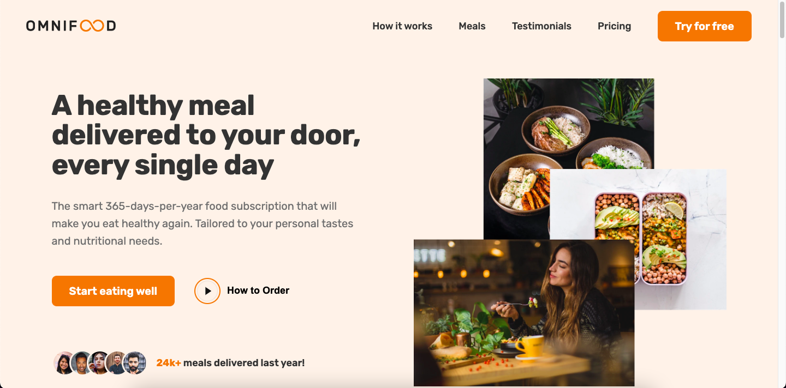

   
  <h2 align="center">OmniFood Website</h2>
  

     Develop a Omnifood website using Vite, Vanilla JavaScript, HTML, and CSS. I've utilized the power of flexbox and grid properties to ensure a seamless and visually stunning website.🌐💻
  

  

### Demo Screeshots

## 🔥 Some key features of this effort include:

- ✨ Experience smooth scrolling and subtle animations
- 📱 Enjoy a fully functional mobile navigation button
- 💻 Compatibility across all devices - mobiles, tablets, and laptops
- 🎨 A beautiful and user-friendly interface

## 👨🏻‍💻 Technologies Used

     

## <a name="quick-start">🤸 Quick Start</a>

Follow these steps to set up the project locally on your machine.

**Prerequisites**

Make sure you have the following installed on your machine:

     

